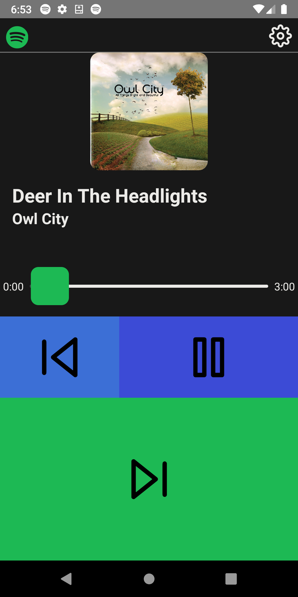

##  Spotify for Bikes

 

This is an app I made to make Spotify more usable while I'm biking. The current Spotify app has buttons that are too small, and tapping quickly is hard while biking because Spotify uses scrollable views.

This is an alternative front-end for the only things I really care about while I'm biking: usability, big buttons, reliability (and the ability to skip through songs quickly 😛).

Here's how you can make one of these for yourself:

1. Clone the repo
2. `yarn install`
3. Setup a token server (really simple, follow the instructions [here](https://github.com/andersonaddo/spotify-for-bike-token-server). That repo also explains why that's needed.
4. Register you app on the [Spotify Developer Dashboard](https://developer.spotify.com/documentation/general/guides/authorization/app-settings/). 
   - Remember to add your Spotify account to the "Users and access"
   - Choose a good callback url (like `http://localhost:8888/callback`)
   - We'll fill in the Android Packages section later
5. Go back to your app and make an .env file that follows the format in `.example.env`
     - If you wan't, you don't have to fill it with actual values, but the .env with those fields has to be there
6. Run `yarn rnuc .env` in the terminal (links the .env to the Javascript and Typescript; won't build without this).
7. Now we're gonna fill the Android Packages section of the Dashboard (otherwise we won't be able to authenticate). To do this, we need both the package name and the SHA1 of the keystore we're using to sign the apk.
   - The package name is just `com.spotifyforbike`. To get the SHA1, we need to follow a few more steps. This assumes you're ok with signing using the default debug keystore React Native uses. If you want to use a custom keystore, a similar process will be used anyways.
   - Go to the project directory, `cd android` and run `./gradlew signingReport`.
   - You're going to see a bunch of outputs that look like this:

```
Variant: debug
Config: debug
Store: <Path to store>
Alias: androiddebugkey
MD5: ...
SHA1: ...
SHA-256: ...
Valid until: Tuesday, April 30, 2052
```
   - Pick the **first one** and use that SHA1 as the one for the Dashboard. Make sure it's all uppercase.
   - You should be good to go! If you're fine with using the dev keystore, run `yarn run makeDebugApk`